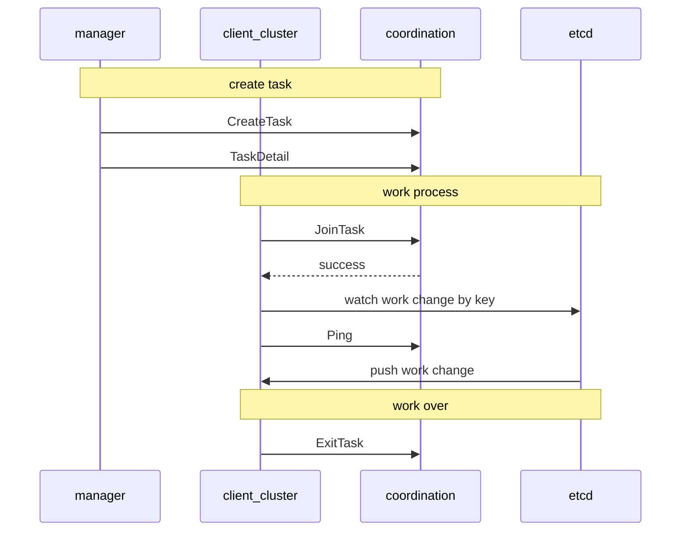

# coordinate
> Turn a stateless cluster into a stateful cluster, based on etcd

### process

```mermaid
sequenceDiagram
participant mgr as manager
participant client as client_cluster
participant coor as coordination
participant etcd as etcd

note over mgr,coor : create task
mgr ->> coor : CreateTask
mgr ->> coor : TaskDetail

note over client,etcd : work process
client ->> coor : JoinTask
coor -->> client : success
client ->> etcd : watch work change by key
client ->> coor : Ping
etcd ->> client : push work change
note over client,etcd : work over
client ->> coor : ExitTask
```

### author
if you need support or have questions, please contact1443965173@qq.com